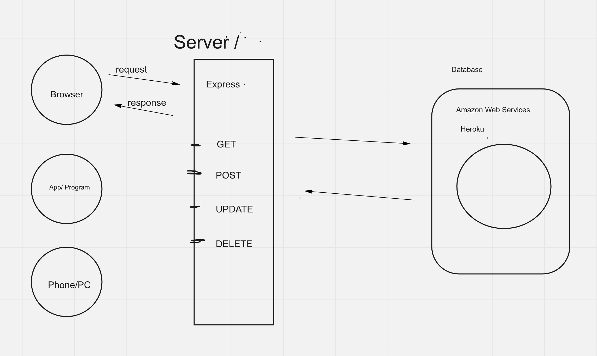

### Server/Client discussion
### Packages
### Express

**Steps for installing packages**

1. `npm init --y`
2. Install packages `npm i [package-name]`

**Steps for Express**

1. Import express
2. Start an express instance
3. Define a port
4. Start listening
5. Run it with ``

